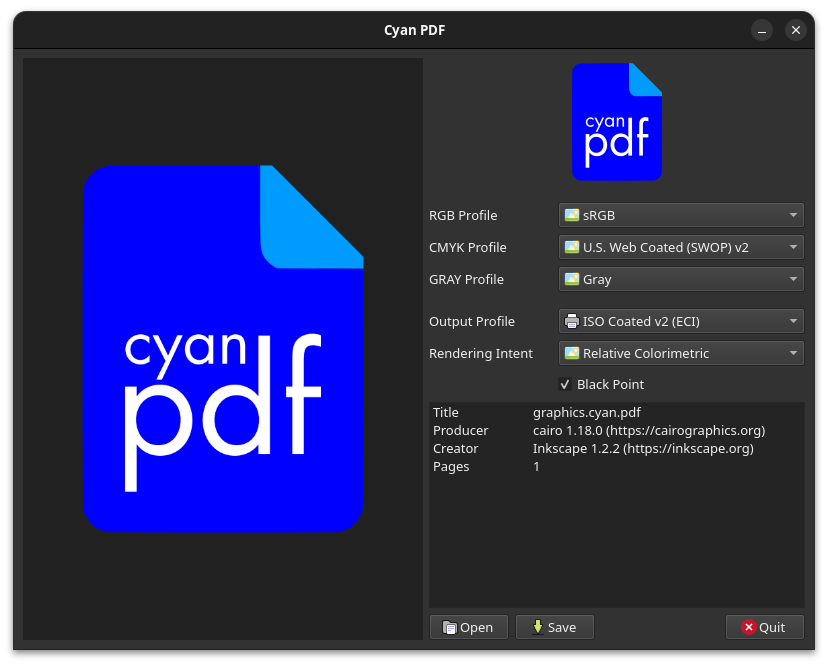

# Cyan PDF



A simple tool designed to convert any PDF into a prepress-ready PDF/X document, ensuring your print projects are ready for professional-quality printing with accurate colors and reliable output.

---

*This project was created to solve a personal need: replicating the CMYK output of Affinity Designer/Publisher on a Linux system using Inkscape.*

## Usage

To begin, create a PDF in your preferred application and then open it with Cyan PDF.

Before you can use Cyan PDF, you must configure the color profiles.

* **Input Profiles:** Set a fallback profile for each colorspace: **RGB**, **CMYK**, and **GRAY**. Cyan PDF will use these if your input PDF doesn't contain embedded profiles, or `Override Input Profiles` is checked *(default on)*.
* **Output Profile**: Next, set the output profile for your target printer. Only **CMYK** and **GRAY** profiles are supported for output. You also need to specify the **rendering intent** and the **black point compensation**.

Once you have configured these settings, click **Save**.

## Build

### Requirements

```
sudo apt install ghostscript liblcms2-dev qt6-base-dev qt6-pdf-dev qt6-svg-dev
```

You will also need a collection of ICC color profiles.

* https://www.color.org/profiles2.xalter
* http://www.eci.org/doku.php?id=en:downloads
* https://www.adobe.com/support/downloads/iccprofiles/iccprofiles_win.html

You can also get a basic set of profiles from the package manager:

```
sudo apt install icc-profiles
```

Always use color profiles recommended by the printer.

### Compile

```
git clone https://github.com/rodlie/cyanpdf
cd cyanpdf
mkdir build && cd build 
cmake -G Ninja -DCMAKE_BUILD_TYPE=Release -DCMAKE_INSTALL_PREFIX=/usr ..
cmake --build .
```

### Install


```
cmake --install .
```

or

```
cmake --install . --prefix /some/location
```

```
├── bin
│   └── cyanpdf
└── share
    ├── applications
    │   └── graphics.cyan.pdf.desktop
    ├── doc
    │   └── cyanpdf-0.9.1
    │       ├── LICENSE
    │       └── README.md
    └── icons
        └── hicolor
            ├── 128x128
            │   └── apps
            │       └── graphics.cyan.pdf.png
            └── scalable
                └── apps
                    └── graphics.cyan.pdf.svg

```
