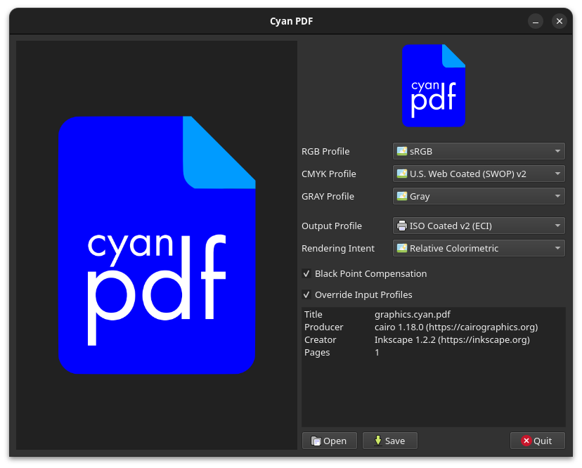

# Cyan PDF



A simple tool designed to convert any PDF into a prepress-ready PDF/X document, ensuring your print projects are ready for professional-quality printing with accurate colors and reliable output.

---

*This project was created to solve a personal need: replicating the CMYK output of Affinity Designer/Publisher on a Linux system.*

## Build

### Requirements

```
sudo apt install ghostscript liblcms2-dev qt6-base-dev qt6-pdf-dev qt6-svg-dev
```

You will also need a collection of ICC color profiles.

* https://www.color.org/profiles2.xalter
* http://www.eci.org/doku.php?id=en:downloads
* https://www.adobe.com/support/downloads/iccprofiles/iccprofiles_win.html

You can also get a basic set of profiles from the package manager:

```
sudo apt install icc-profiles
```

Always use color profiles recommended by the printer.

### Compile

```
mkdir build && cd build 
cmake -G Ninja -DCMAKE_BUILD_TYPE=Release -DCMAKE_INSTALL_PREFIX=/usr ..
cmake --build .
```

### Install


```
cmake --install .
```

or

```
cmake --install . --prefix /some/location
```
